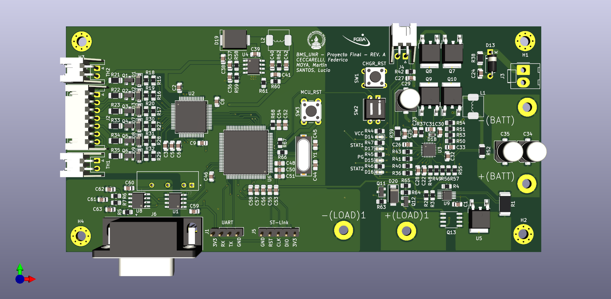

# Battery Management System (BMS) - Hardware

This is the hardware design section of the [BMS project](https://github.com/moyamartin/bms_unr). It was designed with [KiCAD](https://kicad.org/).

Here you will find the design, gerber, [BOM](https://moyamartin.github.io/bms_hardware/) and [render](./render/) files of the PCB.

## Features

As the main goal of this project, this board is designed to support a li-ion
battery pack with a 6 series - 3 parallel architecture based on 18650PF cells
following the next goals:

* Protection
* Balancing
* Charging/Discharging
* Temperature measurement
* Battery SoC (State of Charge) estimation

## Design components/considerations

To meet the project's requirements we have chosen the following components with
their respective role:

* [BQ76PL536A](https://www.ti.com/product/BQ76PL536A): This is a 3 to 6 series
  lithium-ion battery monitor and secondary protection. It is used as a frontend
  analog device to measure each series cell voltage and it has dedicated outputs
  to balance passively through resistors the desired cell.

* [INA226](https://www.ti.com/lit/ds/symlink/ina226.pdf): Bi-Directional current
  and power monitor with I2C compatible interface, we are using this to measure
  the discharge current, fusioning this data with the voltage measurement of
  each cell we can infere the SoC of each cell.

* [BQ24618](https://www.ti.com/lit/ds/symlink/bq24618.pdf): 6 cells Li-Ion
  battery charger, designed to charge the battery pack at a 4A rate with led
  status indication.

* [STM32F407VGTx](https://www.st.com/en/microcontrollers-microprocessors/stm32f407vg.html): ARM Cortex-M microcontroller with DSP instructions and FPU unit, used to estimate the SoC and control all the peripherals and sensors through their respectives communication protocols applying all the mentioned features earlier. It is enabled to interact with other external devices (such as an on-board computer) through CAN and RS232.

* [SN65HVD233](https://www.ti.com/lit/ds/symlink/sn65hvd233.pdf): 3.3V CAN Bus
  transceiver to operate with the latter MCU compatible with ISO 11898 standard.
  This device is isolated from the rest of the components through the [ADuM1201AR](https://www.analog.com/media/en/technical-documentation/data-sheets/ADuM1200_1201.pdf).

* [IRF9310PbF](https://www.infineon.com/dgdl/irf9310pbf.pdf?fileId=5546d462533600a4015356110a7d1d95): Charge and Discarge switch for battery applications, this device is in charge of connection and disconnecting the load from the battery, basically, it's the main endpoint of proetection for the battery pack

